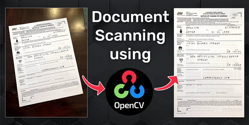
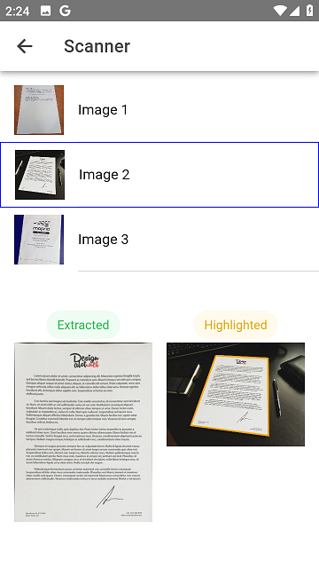

# ionic-vue-mslens-app

Microsoft Lens clone app using `opencv.js` and `jscanify` built with Ionic Vue (Vite)

## Prerequisites

```yaml
node.js: 18.17.1

ionic/cli: 7.2.0
capacitor/cli: 6.1.2
```

## Getting Started

```bash
# install dependencies
$ npm install

# vite
$ npm start

# vite --host 0.0.0.0
$ npm run dev

# CAUTION!
# Be aware of running `ionic serve` as it might cause Blue Screen Fatal Error on your laptop
```

Visit http://localhost:5173/ for **Vite** dev server

## Build Mobile Platforms

```bash
# build
## vue-tsc && vite build
$ npm run build

# copy build
$ ionic cap copy

# IF native portion is updated, THEN sync
$ ionic cap sync
```

### Android

```bash
# live reload
$ ionic cap run android -l --external

$ cd android

$ gradlew clean

# build Android DEBUG apk
$ gradlew assembleDebug

# build Android RELEASE apk
$ gradlew assembleRelease
```





&copy; 2024 All rights reserved.
